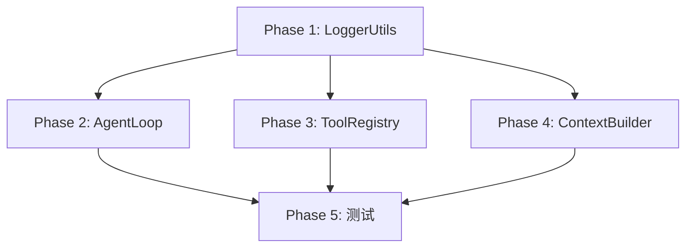

# Agent 调试日志系统方案

> **状态**: 待确认
> **创建时间**: 2026-03-13
> **目标**: 构建高信息密度的 Agent 决策链调试日志体系

---

## 一、需求重述

### 背景

当前 Agent 模块缺乏日志记录，难以观察 Agent 的思考过程（Decision Chain）：

| 模块 | 日志状态 | 问题 |
|------|----------|------|
| **AgentLoop** | ❌ 无日志 | 无法追踪 Thought → Action → Observation 循环 |
| **ToolRegistry** | ❌ 无日志 | 无法确认工具调用成功/失败 |
| **ContextBuilder** | ❌ 无日志 | 无法感知上下文构建异常 |
| **EmailAnalyzer** | ✅ 已有日志 | 可作为参考模板 |

### 核心原则

> **聚焦"决策"与"边界"，而非全量流水账**

1. **Decision** - 记录 Agent 的思考（Thought）、行动选择（Action）
2. **Boundary** - 记录异常边界、截断摘要、执行状态
3. **分级策略** - INFO 打印关键决策，DEBUG 打印原始报文
4. **脱敏截断** - 内置 truncate 函数，避免日志膨胀

### 调试场景定位

追踪 Agent 的 **决策链条（Decision Chain）**：

- Agent 为什么这么决策？
- Agent 看到了什么结果？
- 决策链是否合理？是否有死循环？

**不关注**: 代码运行的底层细节（如文件读取的 buffer）

---

## 二、架构设计

### 2.1 新增文件

```
packages/backend/src/services/agent/
└── utils/
    └── logger-utils.ts    # Agent 专用日志格式化工具
```

### 2.2 LoggerUtils 核心设计

```typescript
// services/agent/utils/logger-utils.ts

import type { Logger } from '../../../config/logger'

/**
 * 截断模式（移除 SUMMARY，保持底层函数纯粹）
 */
export type TruncateMode = 'BOTH' | 'HEAD'

/**
 * 截断配置
 */
export interface TruncateOptions {
  maxLength: number     // 最大长度
  headLength: number    // 头部保留字符数
  tailLength: number    // 尾部保留字符数
  marker?: string       // 省略标记
}

/**
 * 默认截断配置（按内容类型）
 */
export const TRUNCATE_PRESETS: Record<string, TruncateOptions> = {
  THOUGHT: { maxLength: 200, headLength: 50, tailLength: 50 },
  TOOL_ARGS: { maxLength: 100, headLength: 30, tailLength: 30 },
  TOOL_RESULT: { maxLength: 200, headLength: 50, tailLength: 50 },
  LLM_RESPONSE: { maxLength: 200, headLength: 50, tailLength: 50 }
}

/**
 * 截断函数（底层函数保持纯粹，只支持 BOTH 和 HEAD）
 */
export function truncate(
  content: string,
  options: TruncateOptions,
  mode: TruncateMode = 'BOTH'
): string

/**
 * 格式化工具参数
 * 输出格式: Call {toolName} with keys: [arg1, arg2]
 */
export function formatToolArgs(
  toolName: string,
  args: Record<string, unknown>
): string

/**
 * 格式化工具结果
 * 使用 HEAD 模式截断 + 字节规模标注
 * 输出格式: {truncatedContent} (Total: X bytes)
 */
export function formatToolResult(result: unknown): string

/**
 * 创建带 Step 前缀的日志上下文
 */
export function withStep(step: number): string
```

### 2.3 截断策略对照表

| 内容类型 | 模式 | 配置预设 | 输出示例 |
|----------|------|----------|----------|
| **Thought** | `BOTH` | `{ max: 200, head: 50, tail: 50 }` | `The email appears to be... ...action is required.` |
| **Tool Arguments** | - | 提取 JSON keys（独立函数） | `Call search-emails with keys: [query, limit]` |
| **Tool Result** | `HEAD` + 字节标注 | `{ max: 200, head: 50 }` | `Found 3 emails matching... (Total: 1024 bytes)` |
| **LLM Response** | `BOTH` | `{ max: 200, head: 50, tail: 50 }` | `{"classification": "IMPORTANT"... ..."confidence": 0.95}` |

### 2.4 日志格式规范

**统一前缀格式**: `[Agent] [{Module}] [{Step}] {Event}`

```
[Agent] [Loop] [Step 1] Thinking...
[Agent] [Loop] [Step 1] Thought: The email appears to be...
[Agent] [Loop] [Step 1] Action: Call search-emails with keys: [query]
[Agent] [Tool] [Step 1] Result: Found 3 emails matching...
[Agent] [Loop] [Step 2] Thinking...
```

---

## 三、日志记录点设计

### 3.1 AgentLoop（核心优先级）

| 事件 | 级别 | 内容 | 格式 |
|------|------|------|------|
| 迭代开始 | DEBUG | 当前 iteration | `[Step {n}] Starting iteration` |
| LLM 调用前 | DEBUG | 消息数量、token 估算 | `Calling LLM with {n} messages` |
| **Thought** | **INFO** | 思考内容（截断） | `[Step {n}] Thought: {truncated}` |
| **Action** | **INFO** | 工具名 + 参数摘要 | `[Step {n}] Action: {formatToolArgs}` |
| **Observation** | **INFO** | 工具结果（截断） | `[Step {n}] Observation: {truncated}` |
| LLM 响应 | DEBUG | 原始响应（截断） | `LLM response: {truncated}` |
| 迭代结束 | INFO | 完成状态、工具使用列表 | `Completed in {n} steps, tools: [list]` |
| 达到最大迭代 | WARN | 当前状态 | `Reached max iterations ({max})` |

### 3.2 ToolRegistry

> **职责边界**: ToolRegistry 仅记录异常，正常执行日志由 AgentLoop 统一输出

| 事件 | 级别 | 内容 | 格式 |
|------|------|------|------|
| 工具注册 | DEBUG | 工具名、描述 | `Registered tool: {name}` |
| 参数校验失败 | WARN | 错误信息 | `Validation failed for {name}: {errors}` |
| 执行错误 | ERROR | 错误信息 | `Tool {name} failed: {error}` |
| 工具未找到 | ERROR | 工具名 | `Tool not found: {name}` |

> **注意**: ToolRegistry 不记录正常执行的 INFO 日志，避免与 AgentLoop 日志冗余

### 3.3 ContextBuilder

| 事件 | 级别 | 内容 | 格式 |
|------|------|------|------|
| Bootstrap 文件缺失 | WARN | 文件名 | `Bootstrap file not found: {filename}` |
| 上下文超长 | WARN | token 估算 | `Context approaching token limit: {tokens}` |
| 正常加载 | DEBUG | 文件列表 | `Loaded bootstrap: [AGENTS.md, USER.md]` |

---

## 四、实现步骤

### Phase 1: 创建 LoggerUtils

**目标**: 实现日志格式化工具类

**文件**: `packages/backend/src/services/agent/utils/logger-utils.ts`

**核心函数**:

```typescript
import type { Logger } from '../../../config/logger'

// ============ 类型定义 ============

export type TruncateMode = 'BOTH' | 'HEAD'

export interface TruncateOptions {
  maxLength: number
  headLength: number
  tailLength: number
  marker?: string
}

export const TRUNCATE_PRESETS = {
  THOUGHT: { maxLength: 200, headLength: 50, tailLength: 50, marker: '...[truncated]...' },
  TOOL_ARGS: { maxLength: 100, headLength: 30, tailLength: 30, marker: '...' },
  TOOL_RESULT: { maxLength: 200, headLength: 50, tailLength: 50, marker: '...' },
  LLM_RESPONSE: { maxLength: 200, headLength: 50, tailLength: 50, marker: '...[truncated]...' }
} as const

// ============ 核心函数 ============

/**
 * 截断字符串（底层函数保持纯粹，只支持 BOTH 和 HEAD）
 * - BOTH: 保留头尾
 * - HEAD: 仅保留头部
 */
export function truncate(
  content: string,
  options: TruncateOptions,
  mode: TruncateMode = 'BOTH'
): string {
  if (!content) return '(empty)'

  const { maxLength, headLength, tailLength, marker = '...' } = options

  if (content.length <= maxLength) return content

  switch (mode) {
    case 'HEAD':
      return content.slice(0, headLength) + marker

    case 'BOTH':
      return content.slice(0, headLength) + marker + content.slice(-tailLength)

    default:
      return truncate(content, options, 'BOTH')
  }
}

/**
 * 格式化工具参数
 * 输出: Call {toolName} with keys: [arg1, arg2]
 */
export function formatToolArgs(
  toolName: string,
  args: Record<string, unknown>
): string {
  const keys = Object.keys(args)
  if (keys.length === 0) {
    return `Call ${toolName} (no args)`
  }
  return `Call ${toolName} with keys: [${keys.join(', ')}]`
}

/**
 * 格式化工具结果
 * 使用 HEAD 模式截断 + 字节规模标注
 */
export function formatToolResult(result: unknown): string {
  if (result === null || result === undefined) return '(empty)'
  if (result instanceof Error) return `Error: ${result.message}`

  const str = typeof result === 'string' ? result : JSON.stringify(result)
  const size = new TextEncoder().encode(str).length // 计算原始字节数

  if (str.length <= TRUNCATE_PRESETS.TOOL_RESULT.maxLength) {
    return str
  }

  // 使用 HEAD 模式并附加总大小
  const truncated = truncate(str, TRUNCATE_PRESETS.TOOL_RESULT, 'HEAD')
  return `${truncated} (Total: ${size} bytes)`
}

/**
 * 创建 Step 前缀
 */
export function withStep(step: number): string {
  return `[Step ${step}]`
}

/**
 * 创建 Agent 日志前缀
 */
export function agentPrefix(module: string, step?: number): string {
  const stepPart = step !== undefined ? ` [Step ${step}]` : ''
  return `[Agent] [${module}]${stepPart}`
}
```

### Phase 2: 更新 AgentLoop

**目标**: 在关键决策点添加日志

**文件**: `packages/backend/src/services/agent/loop/agent-loop.ts`

**改动**:

```typescript
import { createLogger, type Logger } from '../../../config/logger'
import {
  agentPrefix,
  truncate,
  formatToolArgs,
  formatToolResult,
  TRUNCATE_PRESETS
} from '../utils/logger-utils'

export class AgentLoop {
  private readonly log: Logger = createLogger('AgentLoop')
  // ... 其他属性

  async *run(
    instruction: string,
    email: Email,
    history?: AgentMessage[]
  ): AsyncGenerator<ProgressEvent, void, unknown> {
    const state: AgentState = { /* ... */ }

    // 初始化日志
    this.log.info(
      { maxIterations: this.config.maxIterations },
      `${agentPrefix('Loop')} Starting agent run`
    )

    while (state.iteration < this.config.maxIterations) {
      state.iteration++
      const stepPrefix = agentPrefix('Loop', state.iteration)

      // DEBUG: 迭代开始
      this.log.debug(
        { iteration: state.iteration, messageCount: state.messages.length },
        `${stepPrefix} Starting iteration`
      )

      try {
        // DEBUG: LLM 调用前
        this.log.debug(`${stepPrefix} Calling LLM`)

        const response = await this.provider.chat({ /* ... */ })

        // DEBUG: LLM 原始响应
        if (response.content) {
          this.log.debug(
            { finishReason: response.finishReason },
            `${stepPrefix} LLM response: ${truncate(response.content, TRUNCATE_PRESETS.LLM_RESPONSE)}`
          )
        }

        // INFO: Thought
        if (response.content) {
          const thought = this.stripThinkTags(response.content)
          if (thought) {
            this.log.info(
              `${stepPrefix} Thought: ${truncate(thought, TRUNCATE_PRESETS.THOUGHT)}`
            )
          }
        }

        // INFO: Action + Observation
        if (response.toolCalls.length > 0) {
          for (const toolCall of response.toolCalls) {
            // INFO: Action
            this.log.info(
              `${stepPrefix} Action: ${formatToolArgs(toolCall.name, toolCall.arguments)}`
            )

            const result = await this.toolRegistry.execute(
              toolCall.name,
              toolCall.arguments
            )

            // INFO: Observation
            this.log.info(
              `${stepPrefix} Observation: ${formatToolResult(result)}`
            )
          }
        } else {
          // 最终答案
          this.log.info(
            { toolsUsed: state.toolsUsed },
            `${agentPrefix('Loop')} Completed in ${state.iteration} steps`
          )
          // ...
        }
      } catch (error) {
        // ...
      }
    }

    // WARN: 达到最大迭代
    this.log.warn(
      { maxIterations: this.config.maxIterations },
      `${agentPrefix('Loop')} Reached max iterations`
    )
  }
}
```

### Phase 3: 更新 ToolRegistry

**目标**: 仅记录异常，正常执行日志由 AgentLoop 统一输出

**文件**: `packages/backend/src/services/agent/tools/registry.ts`

**改动**:

```typescript
import { createLogger, type Logger } from '../../../config/logger'

export class ToolRegistry {
  private readonly log: Logger = createLogger('ToolRegistry')
  private tools: Map<string, Tool> = new Map()

  register(tool: Tool): void {
    this.tools.set(tool.name, tool)
    this.log.debug(`Registered tool: ${tool.name}`)
  }

  async execute(name: string, params: Record<string, unknown>): Promise<string> {
    const tool = this.tools.get(name)

    if (!tool) {
      // ERROR: 工具未找到
      this.log.error(`Tool not found: ${name}`)
      return `Error: Tool '${name}' not found`
    }

    try {
      const result = tool.safeParseParams(params)

      if (!result.success) {
        // WARN: 参数校验失败
        this.log.warn(
          { errors: result.error.errors },
          `Validation failed for ${name}`
        )
        return `Error: ${result.error.errors.map(e => e.message).join('; ')}`
      }

      // 正常执行：不打印 INFO 日志，由 AgentLoop 统一输出
      const output = await tool.execute(result.data)
      return output
    } catch (error) {
      // ERROR: 执行错误
      this.log.error(
        { err: error },
        `Tool ${name} failed`
      )
      return `Error executing ${name}: ${error instanceof Error ? error.message : String(error)}`
    }
  }
}
```

> **设计说明**: ToolRegistry 内部无法获取 step 信息，因此不输出带 `[Step X]` 的日志。
> 所有 ReAct 循环的 INFO 日志统一在 AgentLoop 中输出，避免冗余。

### Phase 4: 更新 ContextBuilder

**目标**: 记录边界异常

**文件**: `packages/backend/src/services/agent/context/types.ts`

**改动**:

```typescript
import { createLogger, type Logger } from '../../../config/logger'
import { agentPrefix, truncate, TRUNCATE_PRESETS } from '../utils/logger-utils'

export class ContextBuilder {
  private readonly log: Logger = createLogger('ContextBuilder')

  async loadBootstrapFiles(): Promise<string> {
    const parts: string[] = []
    const loadedFiles: string[] = []

    for (const filename of ContextBuilder.BOOTSTRAP_FILES) {
      const filePath = path.join(this.workspacePath, filename)
      try {
        const content = await fs.readFile(filePath, 'utf-8')
        if (content.trim()) {
          parts.push(`## ${filename}\n\n${content}`)
          loadedFiles.push(filename)
        }
      } catch {
        // WARN: Bootstrap 文件缺失
        this.log.warn(`${agentPrefix('Context')} Bootstrap file not found: ${filename}`)
      }
    }

    // DEBUG: 正常加载
    if (loadedFiles.length > 0) {
      this.log.debug(
        { files: loadedFiles },
        `${agentPrefix('Context')} Loaded bootstrap files`
      )
    }

    return parts.join('\n\n')
  }
}
```

### Phase 5: 单元测试

**目标**: 确保日志工具正确工作

**文件**: `packages/backend/src/services/agent/utils/logger-utils.test.ts`

**测试用例**:

```typescript
import { describe, it, expect } from 'vitest'
import {
  truncate,
  formatToolArgs,
  formatToolResult,
  TRUNCATE_PRESETS
} from './logger-utils'

describe('LoggerUtils', () => {
  describe('truncate', () => {
    it('should return content as-is if under max length', () => {
      const result = truncate('short', TRUNCATE_PRESETS.THOUGHT)
      expect(result).toBe('short')
    })

    it('should truncate with BOTH mode (head + tail)', () => {
      const longContent = 'a'.repeat(300)
      const result = truncate(longContent, TRUNCATE_PRESETS.THOUGHT, 'BOTH')
      expect(result).toContain('...[truncated]...')
      expect(result.length).toBeLessThanOrEqual(TRUNCATE_PRESETS.THOUGHT.maxLength + 20)
    })

    it('should truncate with HEAD mode only', () => {
      const longContent = 'a'.repeat(300)
      const result = truncate(longContent, TRUNCATE_PRESETS.THOUGHT, 'HEAD')
      expect(result).toMatch(/^a{50}\.\.\.$/)
    })

    it('should handle empty content', () => {
      expect(truncate('', TRUNCATE_PRESETS.THOUGHT)).toBe('(empty)')
    })
  })

  describe('formatToolArgs', () => {
    it('should format with keys', () => {
      const result = formatToolArgs('search-emails', { query: 'test', limit: 10 })
      expect(result).toBe('Call search-emails with keys: [query, limit]')
    })

    it('should format with no args', () => {
      const result = formatToolArgs('get-time', {})
      expect(result).toBe('Call get-time (no args)')
    })
  })

  describe('formatToolResult', () => {
    it('should handle null/undefined', () => {
      expect(formatToolResult(null)).toBe('(empty)')
      expect(formatToolResult(undefined)).toBe('(empty)')
    })

    it('should handle Error objects', () => {
      const result = formatToolResult(new Error('test error'))
      expect(result).toBe('Error: test error')
    })

    it('should handle non-string types', () => {
      const result = formatToolResult({ key: 'value' })
      expect(result).toBe('{"key":"value"}')
    })

    it('should truncate long results with byte size annotation', () => {
      const longResult = 'x'.repeat(500)
      const result = formatToolResult(longResult)
      expect(result).toContain('...')
      expect(result).toContain('(Total:')
      expect(result).toContain('bytes)')
    })

    it('should not truncate short results', () => {
      const shortResult = 'short result'
      const result = formatToolResult(shortResult)
      expect(result).toBe('short result')
      expect(result).not.toContain('Total')
    })
  })
})
```

---

## 五、依赖关系



---

## 六、风险评估

| 风险 | 级别 | 缓解措施 |
|------|------|---------|
| 日志过多影响性能 | 低 | INFO 仅记录关键决策，DEBUG 默认关闭 |
| 敏感信息泄露 | 中 | 工具参数仅记录 keys，不记录值 |
| 日志格式不一致 | 低 | 统一使用 agentPrefix 函数 |
| **日志冗余** | 低 | ToolRegistry 不输出 INFO，由 AgentLoop 统一输出 |

---

## 七、工作量估算

| Phase | 内容 | 复杂度 | 预估时间 |
|-------|------|--------|---------|
| Phase 1 | 创建 LoggerUtils | 低 | 1h |
| Phase 2 | 更新 AgentLoop | 中 | 1.5h |
| Phase 3 | 更新 ToolRegistry | 低 | 0.5h |
| Phase 4 | 更新 ContextBuilder | 低 | 0.5h |
| Phase 5 | 单元测试 | 低 | 1h |
| **总计** | | | **4.5h** |

---

## 八、验收标准

1. ✅ `LoggerUtils` 实现截断函数（仅 BOTH 和 HEAD 模式）和格式化函数
2. ✅ `AgentLoop` 在 Thought/Action/Observation 记录 INFO 级别日志
3. ✅ `ToolRegistry` 仅记录 ERROR（执行错误）和 WARN（参数校验失败），不输出 INFO
4. ✅ `ContextBuilder` 仅在 Bootstrap 缺失时记录 WARN
5. ✅ 日志格式统一为 `[Agent] [{Module}] [{Step}] {Event}`
6. ✅ 工具参数仅显示 keys，不显示敏感值
7. ✅ `formatToolResult` 使用 HEAD 模式 + 字节规模标注
8. ✅ 单元测试覆盖 LoggerUtils 所有函数
9. ✅ 设置 `LOG_LEVEL=debug` 可查看详细日志
10. ✅ **避免日志冗余**：ReAct 循环 INFO 日志完全由 AgentLoop 输出

---

## 九、使用示例

**启动调试模式**:

```bash
LOG_LEVEL=debug pnpm --filter @nanomail/backend dev
```

**预期日志输出**:

```
[Agent] [Loop] Starting agent run maxIterations=7
[Agent] [Loop] [Step 1] Thought: The email appears to be a newsletter from... ...unsubscribe link available.
[Agent] [Loop] [Step 1] Action: Call search-emails with keys: [query, limit]
[Agent] [Loop] [Step 1] Observation: Found 3 emails matching the query... (Total: 1024 bytes)
[Agent] [Loop] [Step 2] Thought: Based on the search results...
[Agent] [Loop] Completed in 2 steps toolsUsed=["search-emails"]
```

> **注意**: ToolRegistry 不输出 INFO 日志，所有 Action/Observation 由 AgentLoop 统一输出。

---

**等待确认**: 是否按此方案执行？