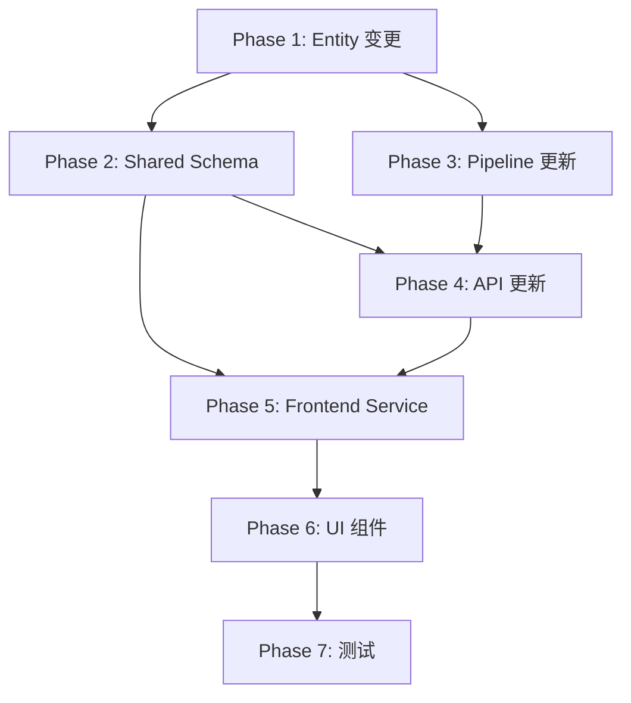

# LLM 字段全链路支持方案

> **状态**: 待确认
> **创建时间**: 2026-03-13
> **相关讨论**: 前后端对 LLM 返回字段的支持情况分析

---

## 一、需求重述

### 背景

LLM 的 `email-analyzer` prompt 返回以下字段：

```json
{
  "classification": "SPAM" | "NEWSLETTER" | "IMPORTANT",
  "confidence": 0.0-1.0,
  "summary": "brief summary",
  "actionItems": [
    {
      "description": "task description",
      "urgency": "HIGH" | "MEDIUM" | "LOW",
      "deadline": "YYYY-MM-DD" or null
    }
  ]
}
```

当前系统对这些字段的支持情况：

| 字段 | 后端 Entity | Shared Schema | API Response | 前端 UI |
|------|-------------|---------------|--------------|---------|
| **classification** | ❌ 仅转换为 `isSpam` | ❌ | ❌ | ❌ |
| **summary** | ✅ | ❌ | ✅ | ✅ |
| **actionItems.deadline** | ❌ 未存储 | ❌ | ❌ | ❌ |

### 目标

1. **classification**：移除 `isSpam`，新增 `classification` 列，支持三种分类
2. **deadline**：Todo Entity 新增 `deadline` 字段，支持日期规划
3. **前端展示**：分类标签在卡片和详情都展示，支持筛选；deadline 支持逾期警告
4. **Shared Schema**：所有类型定义统一管理

### 核心场景

| 场景 | 描述 |
|------|------|
| 邮件分类展示 | 用户在列表中快速识别邮件类型（Important/Newsletter/Spam） |
| 分类筛选 | 用户按分类过滤邮件，聚焦处理重要邮件 |
| 待办日期规划 | 用户查看每个待办的截止日期，识别逾期/临期任务 |
| 待办排序 | TodosPage 按 deadline 排序，临近截止的优先 |

---

## 二、架构设计

### 2.1 数据模型变更

#### Email Entity

```typescript
// Before
@Column({ type: 'boolean', default: false })
isSpam!: boolean

// After
@Column({
  type: 'varchar',
  length: 20,
  default: 'IMPORTANT'
})
classification!: EmailClassification

// 新增索引
@Index(['classification'])
```

#### Todo Entity

```typescript
// 新增字段
@Column({ type: 'datetime', nullable: true })
deadline!: Date | null
```

### 2.2 Shared Schema 变更

#### email.ts

```typescript
// 新增分类枚举
export const EmailClassificationSchema = z.enum(['IMPORTANT', 'NEWSLETTER', 'SPAM'])
export type EmailClassification = z.infer<typeof EmailClassificationSchema>

// 更新 EmailSchema
export const EmailSchema = z.object({
  // ... 现有字段
  classification: EmailClassificationSchema,
  summary: z.string().max(500).nullable(),
  // 移除 isSpam，由前端动态计算
})

// API 响应扩展（保持前端兼容）
export const EmailListItemSchema = EmailSchema.extend({
  isSpam: z.boolean(), // 动态计算：classification === 'SPAM'
})
```

#### todo.ts

```typescript
// 新增 deadline
export const TodoSchema = z.object({
  // ... 现有字段
  deadline: z.string().datetime().nullable(), // ISO 格式
})
```

### 2.3 API 响应设计

```typescript
// GET /api/emails 响应
{
  emails: [{
    id: number,
    classification: 'IMPORTANT' | 'NEWSLETTER' | 'SPAM',
    isSpam: boolean, // 动态计算，保持前端兼容
    summary: string | null,
    // ... 其他字段
  }]
}

// GET /api/todos 响应
{
  todos: [{
    id: number,
    description: string,
    urgency: 'high' | 'medium' | 'low',
    deadline: string | null, // ISO 格式
    // ... 其他字段
  }]
}

// 支持分类筛选
// GET /api/emails?classification=IMPORTANT
```

### 2.4 前端组件设计

#### 分类标签样式映射

```typescript
const classificationConfig: Record<EmailClassification, {
  label: string
  color: string
  bgColor: string
}> = {
  IMPORTANT: {
    label: 'Important',
    color: 'text-red-700',
    bgColor: 'bg-red-100',
  },
  NEWSLETTER: {
    label: 'Newsletter',
    color: 'text-blue-700',
    bgColor: 'bg-blue-100',
  },
  SPAM: {
    label: 'Spam',
    color: 'text-gray-700',
    bgColor: 'bg-gray-100',
  },
}
```

#### Deadline 展示逻辑

```typescript
function getDeadlineStatus(deadline: Date | null): {
  text: string
  isOverdue: boolean
  isUrgent: boolean
} {
  if (!deadline) return { text: 'No deadline', isOverdue: false, isUrgent: false }

  const now = new Date()
  const deadlineDate = new Date(deadline)
  const isOverdue = deadlineDate < now
  const hoursUntil = (deadlineDate.getTime() - now.getTime()) / (1000 * 60 * 60)
  const isUrgent = !isOverdue && hoursUntil <= 24

  return {
    text: formatAbsoluteDate(deadlineDate), // "Mar 16" 或 "2026-03-16"
    isOverdue,
    isUrgent,
  }
}
```

---

## 三、实现步骤

### Phase 1: 后端 Entity 变更

**目标**: 更新数据模型

**文件变更**:

| 文件 | 操作 |
|------|------|
| `backend/src/entities/Email.entity.ts` | 移除 `isSpam`，新增 `classification`，添加索引 |
| `backend/src/entities/Todo.entity.ts` | 新增 `deadline` 字段 |

**详细实现**:

#### Email.entity.ts

```typescript
import {
  Entity,
  PrimaryGeneratedColumn,
  Column,
  Index,
  // ...
} from 'typeorm'

export type EmailClassification = 'IMPORTANT' | 'NEWSLETTER' | 'SPAM'

@Entity('emails')
@Index(['date'])
@Index(['isProcessed'])
@Index(['sender'])
@Index(['message_id'])
@Index(['uid'])
@Index(['uidl'])
@Index(['process_status'])
@Index(['classification']) // 新增索引
export class Email {
  // ... 现有字段保持不变

  // 移除 isSpam 字段
  // @Column({ type: 'boolean', default: false })
  // isSpam!: boolean

  // 新增 classification 字段
  @Column({
    type: 'varchar',
    length: 20,
    default: 'IMPORTANT'
  })
  classification: EmailClassification = 'IMPORTANT'

  // summary 字段已存在，无需修改
  @Column({ type: 'varchar', length: 500, nullable: true })
  summary!: string | null

  // ... 其他字段
}
```

#### Todo.entity.ts

```typescript
@Entity('todos')
export class Todo {
  // ... 现有字段保持不变

  // 新增 deadline 字段
  @Column({ type: 'datetime', nullable: true })
  deadline!: Date | null
}
```

**数据库重置**:

```bash
# 开发阶段，删除数据库文件重新创建
rm -f data/nanomail.db
# 或使用 TypeORM 同步
pnpm --filter @nanomail/backend dev
```

---

### Phase 2: Shared Schema 更新

**目标**: 统一类型定义

**文件变更**:

| 文件 | 操作 |
|------|------|
| `shared/src/schemas/email.ts` | 新增 `EmailClassificationSchema`，更新 `EmailSchema` |
| `shared/src/schemas/todo.ts` | 新增 `deadline` 字段 |
| `shared/src/schemas/index.ts` | 导出新类型 |

#### email.ts

```typescript
import { z } from 'zod'

/**
 * Email classification types
 */
export const EmailClassificationSchema = z.enum(['IMPORTANT', 'NEWSLETTER', 'SPAM'])
export type EmailClassification = z.infer<typeof EmailClassificationSchema>

/**
 * Schema for Email entity
 */
export const EmailSchema = z.object({
  id: z.number().int().positive(),
  subject: z.string().max(500).nullable(),
  sender: z.string().max(255).nullable(),
  snippet: z.string().max(200).nullable(),
  bodyText: z.string().nullable(),
  hasAttachments: z.boolean(),
  date: z.coerce.date(),
  isProcessed: z.boolean(),
  classification: EmailClassificationSchema,
  summary: z.string().max(500).nullable(),
})

/**
 * Schema for email list item (API response)
 * 包含动态计算的 isSpam 字段，保持前端兼容
 */
export const EmailListItemSchema = EmailSchema.extend({
  isSpam: z.boolean(), // classification === 'SPAM'
})

/**
 * Schema for creating a new Email
 */
export const CreateEmailSchema = EmailSchema.omit({
  id: true,
  isProcessed: true,
  classification: true,
  summary: true,
}).extend({
  isProcessed: z.boolean().optional().default(false),
  classification: EmailClassificationSchema.optional().default('IMPORTANT'),
  summary: z.string().max(500).nullable().optional(),
})

// 导出类型
export type Email = z.infer<typeof EmailSchema>
export type EmailListItem = z.infer<typeof EmailListItemSchema>
export type CreateEmail = z.infer<typeof CreateEmailSchema>
```

#### todo.ts

```typescript
import { z } from 'zod'

/**
 * Schema for Todo entity
 */
export const TodoSchema = z.object({
  id: z.number().int().positive(),
  emailId: z.number().int().positive(),
  description: z.string(),
  urgency: z.enum(['high', 'medium', 'low']),
  status: z.enum(['pending', 'in_progress', 'completed']),
  deadline: z.string().datetime().nullable(), // ISO 格式
  createdAt: z.coerce.date(),
})

/**
 * Schema for creating a new Todo
 */
export const CreateTodoSchema = TodoSchema.omit({
  id: true,
  createdAt: true,
})

export type Todo = z.infer<typeof TodoSchema>
export type CreateTodo = z.infer<typeof CreateTodoSchema>
```

---

### Phase 3: 后端 Pipeline 更新

**目标**: 更新 email-analyzer 存储逻辑

**文件**: `backend/src/services/agent/pipeline/email-analyzer.ts`

**关键改动**:

```typescript
async persistResults(email: EmailData, analysis: EmailAnalysis): Promise<void> {
  await this.dataSource.transaction(async (transactionalEntityManager) => {
    const emailRepo = transactionalEntityManager.getRepository(Email)
    const todoRepo = transactionalEntityManager.getRepository(Todo)

    // 更新邮件：使用 classification 替代 isSpam
    await emailRepo.update(
      { id: email.id },
      {
        classification: analysis.classification,
        isProcessed: true,
        summary: analysis.summary || null
      }
    )

    // 创建待办：存储 deadline
    // 注意：使用可选链保护 LLM 输出可能为 undefined 的情况
    if (analysis.classification === 'IMPORTANT' && analysis.actionItems?.length > 0) {
      for (const item of analysis.actionItems) {
        const todo = new Todo()
        todo.emailId = email.id
        todo.description = item.description
        todo.urgency = this.mapUrgency(item.urgency)
        todo.status = 'pending'
        todo.deadline = this.parseDeadline(item.deadline) // 新增

        await todoRepo.save(todo)
      }
    }
  })
}

/**
 * 解析 deadline 字符串为 Date
 * YYYY-MM-DD -> YYYY-MM-DDT23:59:59Z (UTC)
 *
 * 重要：使用 UTC 时区标识（Z）避免跨时区问题
 * 不带时区标识时，Node.js 会按服务器本地时间解析，
 * 导致不同时区用户查看时产生时间偏差
 */
private parseDeadline(deadline: string | null): Date | null {
  if (!deadline) return null

  try {
    // 验证格式 YYYY-MM-DD
    const match = deadline.match(/^(\d{4})-(\d{2})-(\d{2})$/)
    if (!match) return null

    // 转换为当日日终时间（UTC）
    // 使用 Z 后缀确保跨时区一致性
    const [_, year, month, day] = match
    return new Date(`${year}-${month}-${day}T23:59:59Z`)
  } catch {
    return null
  }
}
```

---

### Phase 4: 后端 API 更新

**目标**: 更新 API 响应格式和筛选支持

**文件**: `backend/src/routes/email.routes.ts`

**关键改动**:

```typescript
/**
 * Emails query parameters - 新增 classification 筛选
 */
export interface EmailsQuery extends PaginationQuery {
  processed?: boolean
  classification?: EmailClassification // 新增
}

/**
 * EmailsResponse - 更新响应结构
 */
export interface EmailsResponse {
  emails: Array<{
    id: number
    subject: string | null
    sender: string | null
    snippet: string | null
    summary: string | null
    date: string
    isProcessed: boolean
    classification: EmailClassification // 新增
    isSpam: boolean // 动态计算
    hasAttachments: boolean
  }>
  pagination: { /* ... */ }
}

// GET /api/emails 实现
router.get('/', async (req, res, next) => {
  try {
    // 解析查询参数
    const classification = req.query.classification as EmailClassification | undefined
    const page = parseInt(req.query.page as string) || 1
    const limit = parseInt(req.query.limit as string) || 10

    // 构建 where 条件
    const where: Record<string, unknown> = {}
    if (req.query.processed !== undefined) {
      where.isProcessed = req.query.processed === 'true'
    }
    if (classification) {
      where.classification = classification
    }

    // 使用 findAndCount 获取分页数据
    const [emails, total] = await emailRepository.findAndCount({
      where,
      order: { date: 'DESC' },
      skip: (page - 1) * limit,
      take: limit,
    })

    // 格式化响应
    const response: EmailsResponse = {
      emails: emails.map((email) => ({
        id: email.id,
        subject: email.subject,
        sender: email.sender,
        snippet: email.snippet,
        summary: email.summary,
        date: email.date.toISOString(),
        isProcessed: email.isProcessed,
        classification: email.classification,
        isSpam: email.classification === 'SPAM', // 动态计算
        hasAttachments: email.hasAttachments,
      })),
      pagination: {
        page,
        limit,
        total,
        totalPages: Math.ceil(total / limit),
      },
    }

    res.json(response)
  } catch (error) {
    next(error)
  }
})
```

**文件**: `backend/src/routes/todo.routes.ts` (如需新增)

```typescript
// GET /api/todos - 支持 deadline 排序
router.get('/', async (req, res, next) => {
  try {
    // 使用 TypeORM 原生排序功能，避免内存排序的性能问题
    // nulls: 'LAST' 确保 null deadline 排在末尾
    const todos = await todoRepository.find({
      order: {
        deadline: { direction: 'ASC', nulls: 'LAST' },
        createdAt: 'ASC',
      },
    })

    res.json({
      todos: todos.map(todo => ({
        id: todo.id,
        emailId: todo.emailId,
        description: todo.description,
        urgency: todo.urgency,
        status: todo.status,
        deadline: todo.deadline?.toISOString() ?? null,
        createdAt: todo.createdAt.toISOString(),
      })),
    })
  } catch (error) {
    next(error)
  }
})
```

---

### Phase 5: 前端 Service 更新

**目标**: 更新类型定义和 API 调用

**文件**: `frontend/src/services/email.service.ts`

```typescript
import type { EmailClassification, EmailListItem } from '@nanomail/shared'

export interface EmailListItem {
  id: number
  subject: string | null
  sender: string | null
  snippet: string | null
  summary: string | null
  date: string
  isProcessed: boolean
  classification: EmailClassification
  isSpam: boolean
  hasAttachments: boolean
}

export interface EmailsQuery {
  page?: number
  limit?: number
  processed?: boolean
  classification?: EmailClassification // 新增
}

export const EmailService = {
  async getEmails(query: EmailsQuery = {}): Promise<EmailsResponse> {
    const { page = 1, limit = 10, processed, classification } = query

    const params = new URLSearchParams()
    params.set('page', String(page))
    params.set('limit', String(limit))

    if (processed !== undefined) {
      params.set('processed', String(processed))
    }
    if (classification) {
      params.set('classification', classification)
    }

    const response = await fetch(`/api/emails?${params.toString()}`)
    // ...
  },
}
```

**文件**: `frontend/src/services/todo.service.ts`

```typescript
export interface TodoItem {
  id: number
  emailId: number
  description: string
  urgency: 'high' | 'medium' | 'low'
  status: 'pending' | 'in_progress' | 'completed'
  deadline: string | null // ISO 格式
  createdAt: string
}
```

---

### Phase 6: 前端 UI 组件

**目标**: 实现分类标签和 deadline 展示

#### 6.1 分类标签组件

**文件**: `frontend/src/components/ClassificationTag.tsx`

```typescript
import { cn } from '@/lib/utils'
import type { EmailClassification } from '@nanomail/shared'

interface ClassificationTagProps {
  classification: EmailClassification
  size?: 'sm' | 'md'
}

const config: Record<EmailClassification, { label: string; className: string }> = {
  IMPORTANT: {
    label: 'Important',
    className: 'bg-red-100 text-red-700 border-red-200',
  },
  NEWSLETTER: {
    label: 'Newsletter',
    className: 'bg-blue-100 text-blue-700 border-blue-200',
  },
  SPAM: {
    label: 'Spam',
    className: 'bg-gray-100 text-gray-600 border-gray-200',
  },
}

export function ClassificationTag({ classification, size = 'sm' }: ClassificationTagProps) {
  const { label, className } = config[classification]

  return (
    <span
      className={cn(
        'inline-flex items-center rounded border px-1.5 font-medium',
        size === 'sm' ? 'text-xs' : 'text-sm px-2 py-0.5',
        className
      )}
    >
      {label}
    </span>
  )
}
```

#### 6.2 更新 EmailCard

**文件**: `frontend/src/features/inbox/EmailCard.tsx`

```typescript
import { ClassificationTag } from '@/components/ClassificationTag'
import type { EmailClassification } from '@nanomail/shared'

export interface EmailCardProps {
  email: {
    id: number
    sender: string | null
    subject: string | null
    snippet: string | null
    date: Date
    isProcessed: boolean
    classification: EmailClassification // 替换 isSpam
  }
  selected: boolean
  onSelect: (id: number) => void
  selectionDisabled?: boolean
}

export function EmailCard({ email, selected, onSelect, selectionDisabled }: EmailCardProps) {
  const isSpam = email.classification === 'SPAM'

  return (
    <div
      className={cn(
        'p-4 rounded-lg transition-colors cursor-pointer',
        selected ? 'bg-primary/10 border border-primary' : 'hover:bg-muted',
        isSpam && 'opacity-60'
      )}
      onClick={() => !selectionDisabled && onSelect(email.id)}
    >
      <div className="flex items-start gap-3">
        {/* 阻止事件冒泡，避免点击 Checkbox 时触发父级 onClick */}
        <Checkbox
          checked={selected}
          onCheckedChange={() => onSelect(email.id)}
          onClick={(e) => e.stopPropagation()}
        />

        <div className="flex-1 min-w-0">
          <div className="flex items-center justify-between gap-2">
            <div className="flex items-center gap-2 min-w-0">
              <span className="font-medium truncate">
                {email.sender || 'Unknown sender'}
              </span>
              {/* 分类标签 */}
              <ClassificationTag classification={email.classification} />
            </div>
            <span className="text-xs text-muted-foreground shrink-0">
              {formatRelativeDate(email.date)}
            </span>
          </div>

          <p className="text-sm font-medium truncate">
            {email.subject || '(No subject)'}
          </p>

          <p className="text-xs text-muted-foreground line-clamp-2 mt-1">
            {email.snippet || ''}
          </p>
        </div>

        {email.isProcessed && (
          <CheckCircle className="h-5 w-5 text-green-500 shrink-0" />
        )}
      </div>
    </div>
  )
}
```

#### 6.3 分类筛选器

**文件**: `frontend/src/features/inbox/ClassificationFilter.tsx`

```typescript
import { cn } from '@/lib/utils'
import type { EmailClassification } from '@nanomail/shared'

interface ClassificationFilterProps {
  value: EmailClassification | 'ALL'
  onChange: (value: EmailClassification | 'ALL') => void
}

const options: Array<{ value: EmailClassification | 'ALL'; label: string }> = [
  { value: 'ALL', label: 'All' },
  { value: 'IMPORTANT', label: 'Important' },
  { value: 'NEWSLETTER', label: 'Newsletter' },
  { value: 'SPAM', label: 'Spam' },
]

export function ClassificationFilter({ value, onChange }: ClassificationFilterProps) {
  return (
    <div className="flex gap-1 p-1 bg-muted rounded-lg">
      {options.map((option) => (
        <button
          key={option.value}
          onClick={() => onChange(option.value)}
          className={cn(
            'px-3 py-1.5 text-sm font-medium rounded-md transition-colors',
            value === option.value
              ? 'bg-background shadow-sm'
              : 'text-muted-foreground hover:text-foreground'
          )}
        >
          {option.label}
        </button>
      ))}
    </div>
  )
}
```

#### 6.4 更新 InboxPage

**文件**: `frontend/src/features/inbox/InboxPage.tsx`

```typescript
import { ClassificationFilter } from './ClassificationFilter'
import type { EmailClassification } from '@nanomail/shared'

export function InboxPage() {
  const [classificationFilter, setClassificationFilter] = useState<EmailClassification | 'ALL'>('ALL')

  const { data, isLoading, refetch } = useQuery({
    queryKey: ['emails', 1, 10, classificationFilter],
    queryFn: () => EmailService.getEmails({
      page: 1,
      limit: 10,
      classification: classificationFilter === 'ALL' ? undefined : classificationFilter,
    }),
  })

  return (
    <div className="p-6">
      <div className="flex items-center justify-between mb-4">
        <h1 className="text-2xl font-bold">Inbox</h1>
        <div className="flex items-center gap-4">
          {/* 分类筛选器 */}
          <ClassificationFilter
            value={classificationFilter}
            onChange={setClassificationFilter}
          />
          <Button variant="outline" size="sm" onClick={handleSync}>
            <RefreshCw className="h-4 w-4 mr-2" />
            Sync
          </Button>
        </div>
      </div>

      {/* 邮件列表 */}
      {/* ... */}
    </div>
  )
}
```

#### 6.5 Deadline 展示组件

**文件**: `frontend/src/components/DeadlineDisplay.tsx`

```typescript
import { cn } from '@/lib/utils'
import { AlertTriangle } from 'lucide-react'

interface DeadlineDisplayProps {
  deadline: string | null // ISO 格式
}

export function DeadlineDisplay({ deadline }: DeadlineDisplayProps) {
  if (!deadline) {
    return (
      <span className="text-xs text-muted-foreground">No deadline</span>
    )
  }

  const deadlineDate = new Date(deadline)
  const now = new Date()
  const isOverdue = deadlineDate < now
  const hoursUntil = (deadlineDate.getTime() - now.getTime()) / (1000 * 60 * 60)
  const isUrgent = !isOverdue && hoursUntil <= 24

  // 格式化为绝对日期 "Mar 16" 或 "2026-03-16"
  const formatted = deadlineDate.toLocaleDateString('en-US', {
    month: 'short',
    day: 'numeric',
  })

  return (
    <span
      className={cn(
        'inline-flex items-center gap-1 text-xs font-medium',
        isOverdue && 'text-red-600',
        isUrgent && 'text-amber-600',
        !isOverdue && !isUrgent && 'text-muted-foreground'
      )}
    >
      {(isOverdue || isUrgent) && (
        <AlertTriangle className="h-3 w-3" />
      )}
      {isOverdue && 'Overdue: '}
      {isUrgent && !isOverdue && 'Due today: '}
      {formatted}
    </span>
  )
}
```

#### 6.6 更新 TodosPage

**文件**: `frontend/src/pages/TodosPage.tsx`

```typescript
import { DeadlineDisplay } from '@/components/DeadlineDisplay'
import { cn } from '@/lib/utils'

export function TodosPage() {
  const { data } = useQuery({
    queryKey: ['todos'],
    queryFn: TodoService.getTodos,
  })

  return (
    <div className="p-6">
      <h1 className="text-2xl font-bold mb-4">Todos</h1>

      <div className="space-y-2">
        {data?.todos.map((todo) => {
          const isOverdue = todo.deadline && new Date(todo.deadline) < new Date()

          return (
            <div
              key={todo.id}
              className={cn(
                'p-4 rounded-lg border',
                isOverdue && 'border-red-200 bg-red-50'
              )}
            >
              <div className="flex items-center justify-between">
                <div className="flex items-center gap-3">
                  <Checkbox
                    checked={todo.status === 'completed'}
                    onCheckedChange={() => handleToggle(todo)}
                  />
                  <span className={cn(
                    todo.status === 'completed' && 'line-through text-muted-foreground'
                  )}>
                    {todo.description}
                  </span>
                </div>

                <div className="flex items-center gap-3">
                  <DeadlineDisplay deadline={todo.deadline} />
                  <span className={cn(
                    'text-xs font-medium',
                    todo.urgency === 'high' && 'text-red-500',
                    todo.urgency === 'medium' && 'text-yellow-500',
                    todo.urgency === 'low' && 'text-green-500',
                  )}>
                    {todo.urgency}
                  </span>
                </div>
              </div>
            </div>
          )
        })}
      </div>
    </div>
  )
}
```

---

### Phase 7: 测试更新

**目标**: 确保所有变更正确工作

**测试文件**:

| 文件 | 测试内容 |
|------|---------|
| `backend/src/entities/Email.entity.test.ts` | classification 字段验证 |
| `backend/src/entities/Todo.entity.test.ts` | deadline 字段验证 |
| `backend/src/routes/email.routes.test.ts` | classification 筛选测试 |
| `backend/src/services/agent/pipeline/email-analyzer.test.ts` | deadline 解析和存储 |
| `frontend/src/components/ClassificationTag.test.tsx` | 标签渲染 |
| `frontend/src/components/DeadlineDisplay.test.tsx` | 逾期状态展示 |

---

## 四、依赖关系



**关键路径**: Entity → Schema → Pipeline → API → Service → UI

---

## 五、风险评估

| 风险 | 级别 | 缓解措施 |
|------|------|---------|
| 数据库迁移导致数据丢失 | 高 | 开发阶段重置数据，生产环境需迁移脚本 |
| isSpam 移除影响现有代码 | 中 | API 层动态计算 isSpam，保持兼容 |
| deadline 时区处理 | 中 | **使用 UTC 时间（带 Z 后缀），前端按本地时区展示** |
| 分类标签样式不统一 | 低 | 使用共享的 ClassificationTag 组件 |
| Todo 排序性能 | 低 | **使用 TypeORM 原生 `nulls: 'LAST'` 排序** |
| LLM 输出不稳定 | 中 | **使用可选链 `?.` 防御 `undefined`/`null` 输出** |
| UI 事件冒泡 | 低 | **Checkbox 添加 `stopPropagation()` 阻止冒泡** |

---

## 六、架构与规范对齐

### 6.1 API 日志与代理路由

在修改和扩展 `/api/emails` 和 `/api/todos` 路由时：

- **保持现有 API 层日志记录机制原状**，不触碰或修改
- 前端在 `EmailService` 拼接请求路径时，确保新拼接的查询参数**不会破坏原有的 URL 代理规则**（如 `/api.php` 结构）

### 6.2 Zod Schema 使用规范

在 `CreateEmailSchema` 中使用了 `.optional().default('IMPORTANT')`：

```typescript
classification: EmailClassificationSchema.optional().default('IMPORTANT')
```

**重要**：后端使用该 Schema 解析请求体时，必须调用 `Schema.parse()` 而不是直接信任原始 `req.body`，以触发 default 值的注入：

```typescript
// ✅ 正确：使用 parse() 触发 default 值
const validatedData = CreateEmailSchema.parse(req.body)

// ❌ 错误：直接信任原始 body，default 值不会生效
const { classification } = req.body
```

### 6.3 紧急状态 (Urgency) 逻辑说明

`isUrgent` 的计算公式为 `hoursUntil <= 24`。产品定义：

- **Urgent**: 截止时间在 24 小时内（包括今天到期）
- **Overdue**: 已超过截止时间

对于仅有日期（无具体时间）的任务，"今天到期"本身就代表 Urgent。此逻辑与产品预期一致。

---

## 八、工作量估算

| Phase | 内容 | 复杂度 | 预估时间 |
|-------|------|--------|---------|
| Phase 1 | Entity 变更（Email + Todo） | 低 | 0.5h |
| Phase 2 | Shared Schema 更新 | 低 | 0.5h |
| Phase 3 | Pipeline 更新（deadline 解析 + 防御性处理） | 低 | 0.5h |
| Phase 4 | API 更新（筛选 + 排序 + 分页） | 中 | 1h |
| Phase 5 | Frontend Service 更新 | 低 | 0.5h |
| Phase 6 | UI 组件（标签 + 筛选 + Deadline + 事件处理） | 中 | 2h |
| Phase 7 | 测试更新 | 中 | 1.5h |
| **总计** | | | **6.5h** |

---

## 九、验收标准

### 后端

1. ✅ Email Entity 移除 `isSpam`，新增 `classification` 列
2. ✅ Todo Entity 新增 `deadline` 列（`datetime, nullable`）
3. ✅ 数据库为 `classification` 添加索引
4. ✅ Shared Schema 定义 `EmailClassification` 枚举
5. ✅ Pipeline 正确解析和存储 `deadline`（YYYY-MM-DD → **YYYY-MM-DDT23:59:59Z UTC**）
6. ✅ Pipeline 使用可选链 `?.` 防御 LLM 可能返回 `undefined` 的 `actionItems`
7. ✅ API 支持 `?classification=IMPORTANT` 筛选
8. ✅ API 使用 `findAndCount` 获取分页数据（包含 total）
9. ✅ API 响应包含 `classification` 和动态计算的 `isSpam`
10. ✅ Todos API 使用 TypeORM 原生 `nulls: 'LAST'` 排序，避免内存排序
11. ✅ 后端使用 `Schema.parse()` 解析请求体，确保 default 值生效

### 前端

12. ✅ EmailCard 显示分类标签
13. ✅ EmailDetail 显示分类信息
14. ✅ InboxPage 支持分类筛选（All/Important/Newsletter/Spam）
15. ✅ EmailCard Checkbox 添加 `stopPropagation()` 阻止事件冒泡
16. ✅ DeadlineDisplay 正确展示绝对日期
17. ✅ 逾期/临期 deadline 红色警告
18. ✅ TodosPage 按 deadline 排序

### 测试

19. ✅ 所有单元测试通过
20. ✅ 前端组件测试通过

---

## 十、后续扩展

1. **用户自定义分类**: 支持用户添加自定义分类标签
2. **deadline 提醒**: 集成通知系统，到期前提醒
3. **日历集成**: 将 Todo 同步到日历应用
4. **批量操作**: 按分类批量标记/删除邮件

---

**等待确认**: 是否按此方案执行？